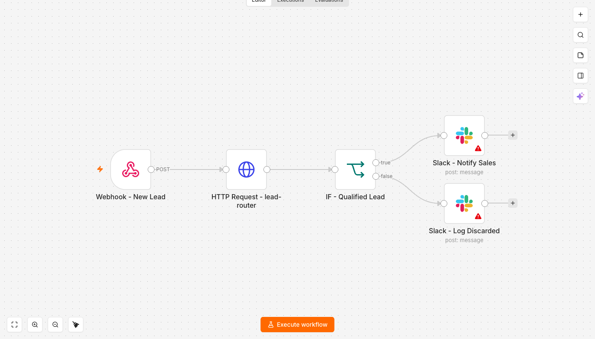

# Lead Enrichment and Scoring

Recebe um lead por webhook, manda pro [`lead-router`](https://github.com/GusMesquita/lead-router)
(que enriquece pelo CNPJ e pontua com o Claude) e roteia o resultado no Slack: qualificado
vai pro canal de vendas, o resto vira log.



```
Webhook - New Lead → HTTP Request - lead-router → IF - Qualified Lead ─┬─ true  → Slack - Notify Sales
                                                                       └─ false → Slack - Log Discarded
```

## Variáveis de ambiente do n8n

| Variável | Para quê |
| --- | --- |
| `LEAD_ROUTER_URL` | Base do serviço, ex. `http://host.docker.internal:8000` |
| `LEAD_ROUTER_API_KEY` | Vai no header `X-API-Key`; deve bater com `API_KEYS` do backend |

Elas só chegam nas expressões se o n8n subir com `N8N_BLOCK_ENV_ACCESS_IN_NODE=false` —
o padrão é bloquear, e sem isso todo `{{ $env.X }}` falha com *access to env vars denied*.
O `compose.yaml` da raiz já define isso.

## Credenciais

Os dois nós Slack precisam de uma credencial **Slack API** com escopo `chat:write`,
selecionada na UI depois de importar. O JSON referencia canais por nome
(`#leads-qualificados`, `#leads-descartados`) — troque pelos seus.

## Testando

```bash
curl -X POST http://127.0.0.1:5678/webhook-test/new-lead \
  -H 'Content-Type: application/json' \
  -d '{"name":"Fulano","email":"fulano@empresa.com.br","company":"Empresa","cnpj":"19131243000197"}'
```

O corpo do POST é repassado ao `lead-router` como `{{ $json.body }}` — o webhook v2 entrega
o payload aninhado em `body`, junto de `headers` e `query`. Mandar `{{ $json }}` cru enviaria
os headers do requisitante para o backend.

## Decisão de corte

O `IF` compara `score >= 60` com `typeValidation: "strict"`: se o `lead-router` devolver
`score` como string, o nó falha em vez de comparar texto com número e mandar o lead pro
lado errado calado. Para mudar o corte, edite `rightValue` no nó `IF - Qualified Lead`.
