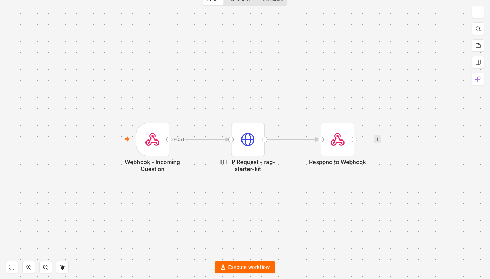

# RAG FAQ Autoresponder

Recebe uma pergunta por webhook, consulta o [`rag-starter-kit`](https://github.com/GusMesquita/rag-starter-kit)
e devolve a resposta — com as fontes — na mesma requisição HTTP.



```
Webhook - Incoming Question → HTTP Request - rag-starter-kit → Respond to Webhook
```

## Variáveis de ambiente do n8n

| Variável | Para quê |
| --- | --- |
| `RAG_STARTER_KIT_URL` | Base do serviço, ex. `http://host.docker.internal:8002` |
| `RAG_STARTER_KIT_API_KEY` | Vai no header `X-API-Key`; deve bater com `API_KEYS` do backend |

Como no outro workflow, elas dependem de `N8N_BLOCK_ENV_ACCESS_IN_NODE=false`.

## Porta

O `rag-starter-kit` escuta em 8000 dentro do container dele; publique no host em **8002**,
porque 8000 é do `lead-router` e 8001 é do `brasilapi-mcp-server`. Versões anteriores deste
workflow apontavam para 8001 e batiam no serviço errado.

## Testando

```bash
curl -X POST http://127.0.0.1:5678/webhook-test/faq-question \
  -H 'Content-Type: application/json' \
  -d '{"question":"Qual é a política de reembolso?"}'
```

`responseMode: responseNode` faz o webhook esperar o nó `Respond to Webhook`: quem chamou
recebe a resposta do RAG, não um `{"message":"Workflow was started"}`. A resposta inclui
`sources` — o `rag-starter-kit` devolve uma entrada por documento, e repassar isso deixa
quem consome conferir a resposta em vez de confiar nela.
